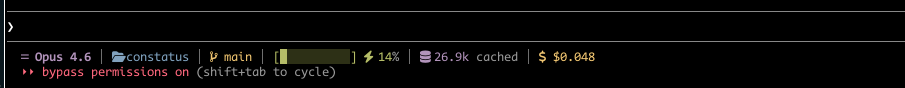

# constatus

A configurable status line for Claude Code that displays context, token usage, cost, and git branch information.



## Installation

### With Cargo

```bash
cargo install --path .
```

### With Nix

Build and install via the flake:

```bash
nix build                # Build the package
nix run                  # Run directly
nix shell              # Enter dev environment
nix flake show         # View all outputs
```

Or add to your flake inputs:

```nix
constatus.url = "github:user/constatus";
```

## Usage

constatus reads JSON from stdin and formats a status line based on your configuration:

```bash
echo '{"model":{"display_name":"Claude Opus 4.6"},"workspace":{"current_dir":"/home/user/project"},"context_window":{"remaining_percentage":70}}' | constatus
```

## Output Examples

**Default preset:**
```
󰇼 Claude Opus 4.6 │  project │  main │ [███░░░░░░░] 30% │ 256K cached │ 💰 $0.15
```

## Placeholders

The following placeholders are available in format strings:

- `{model}` — AI model name
- `{dir}` — Current directory name
- `{branch}` — Git branch name
- `{context}` — Context window usage percentage
- `{bar}` — Visual progress bar
- `{cache}` — Cache read tokens
- `{input}` — Input tokens
- `{output}` — Output tokens
- `{cost}` — Estimated cost
- `{duration}` — Time since conversation started

Prefix with `?` to hide empty sections: `?{branch}` only shows if a branch is found.

## Presets

**Minimal:**
```
{model} | {dir} | ?{branch}
```

**Default:**
```
{model} | {dir} | ?{branch} | {bar} {context}% | ?{cache} cached | ?{cost}
```

**Full:**
```
{model} | {dir} | ?{branch} | {bar} {context}% | ?{cache} cached | ?In: {input} | ?Out: {output} | ?{cost} | ?{duration}
```

## Options

```
-f, --format <FORMAT>       Custom format string (overrides preset)
-p, --preset <PRESET>       Preset: minimal, default, full [default: default]
-F, --fallback <TEXT>       Fallback when no data available [default: "Claude Ready"]
-s, --separator <SEP>       Section separator [default: " │ "]
-c, --color <MODE>          Color mode: always, never, auto [default: auto]
-i, --icons                 Enable Nerd Font icons [default: true]
--no-icons                  Disable icons
-w, --bar-width <N>         Progress bar width in chars [default: 10]
```

## Input Format

constatus expects JSON with the following structure (all fields optional):

```json
{
  "model": {
    "display_name": "Claude Opus 4.6"
  },
  "workspace": {
    "current_dir": "/path/to/project"
  },
  "context_window": {
    "remaining_percentage": 70,
    "current_usage": {
      "cache_read_input_tokens": 256000,
      "input_tokens": 1500,
      "output_tokens": 800
    }
  },
  "conversation": {
    "started_at": "2025-03-07T14:30:00Z"
  }
}
```

## Colors

Color output adapts based on context usage:
- **Green:** Low usage (< 50%)
- **Yellow:** Medium usage (50–70%)
- **Red:** High usage (≥ 70%)

The `{branch}` field appears in yellow when a git branch is detected.

## Features

- **Git branch detection:** Runs `git rev-parse --abbrev-ref HEAD` in the workspace directory
- **Token tracking:** Displays input, output, and cache read tokens with abbreviations (k, M)
- **Cost estimation:** Calculates approximate API costs based on token counts
- **Graceful degradation:** Missing data is silently omitted (especially useful with `?` prefix)
- **Nerd Font icons:** Optional icons for visual appeal (disable with `--no-icons`)
- **Color control:** Auto-detects terminal support or override with `--color`

## Development

Enter the dev shell with all build tools:

```bash
nix flake update    # Update dependencies
direnv allow        # Auto-load environment (requires direnv)
```

Available shell scripts:
- `dx` — Edit `flake.nix`
- `rx` — Edit `Cargo.toml`

Run tests and build:

```bash
cargo build
cargo test
nix build
```
